# 购物网站 电商网站（个人独立编写，不是网上资源）

## 一、介绍（获取源码，[查看文章末尾](#四-咨询我们)） 
计算机毕业设计 课设 购物网站选题 可以拓展为其它商城类项目 前后端分离项目，分为两个角色，管理员和用户
 1. 用户：登录，商品购买，搜索，领取优惠券，查看订单，管理收货地址，商品评论等等
 2. 管理员：用户管理，商品管理，订单管理，用户管理，优惠券管理等等

## 二、技术栈
1. 前端：vue框架，微信原生小程序
2. 后端：nodejs express框架
3. 数据库：mysql

## 三、效果展示  
### 1. 用户端（小程序）

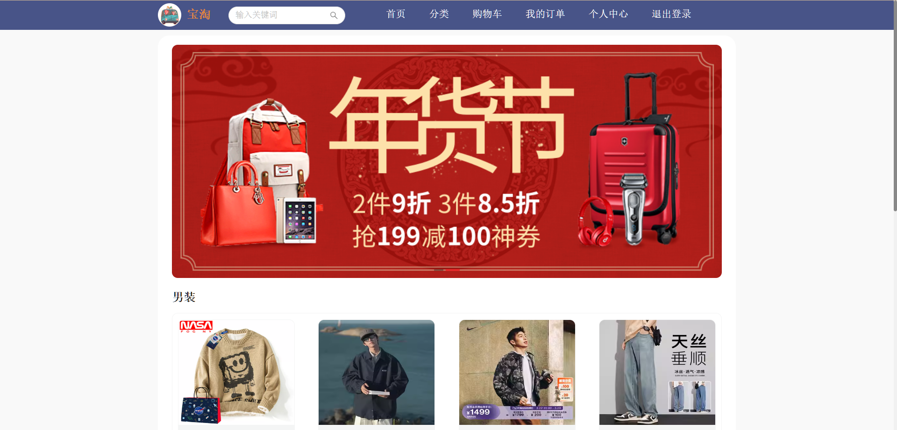
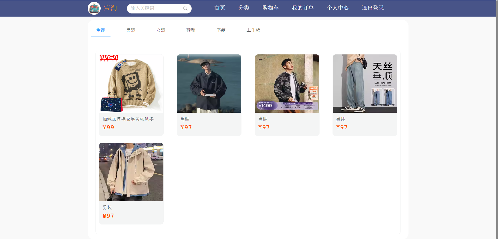

 

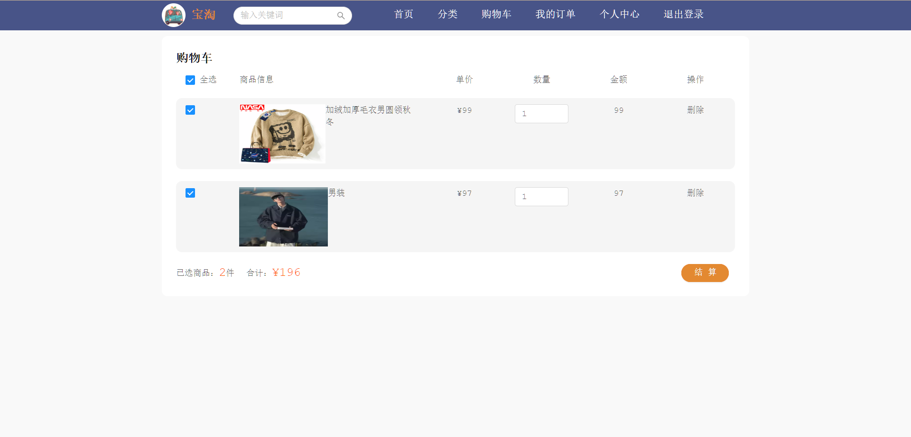
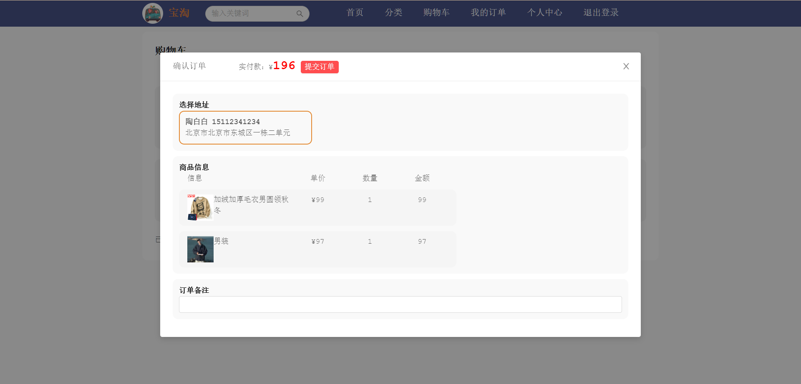

 

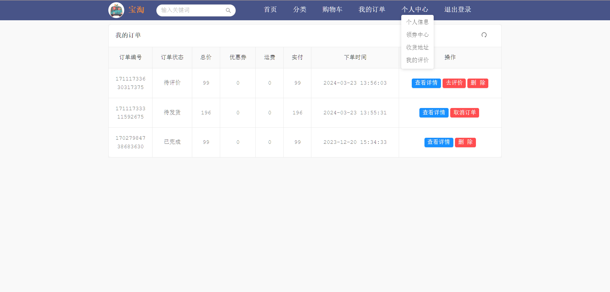
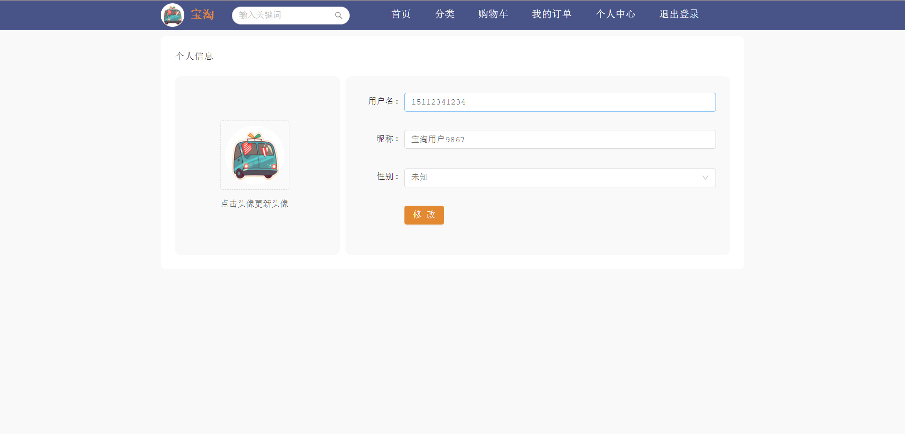

 

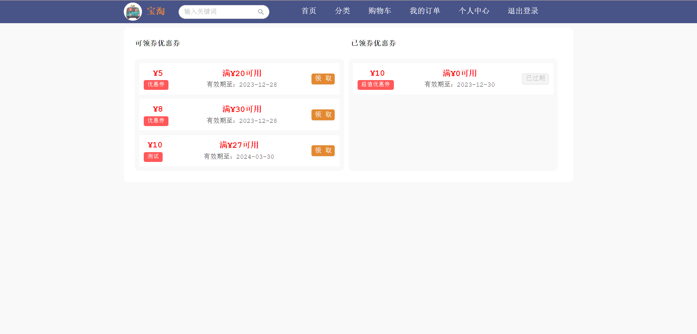

 

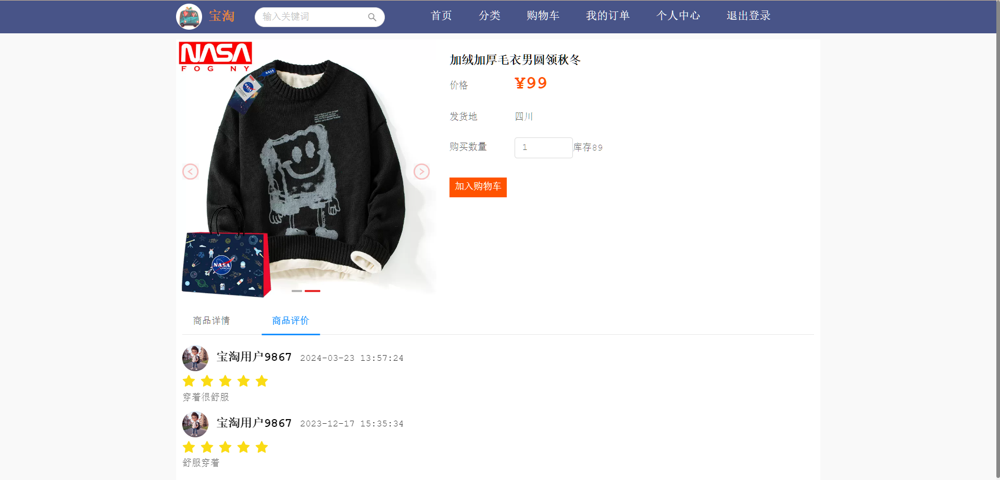

### 2. 后台管理（管理端）

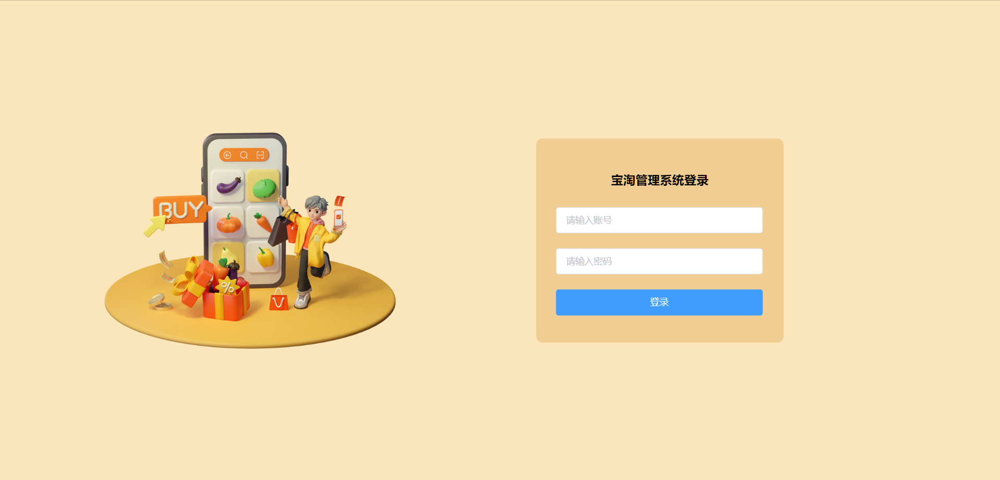
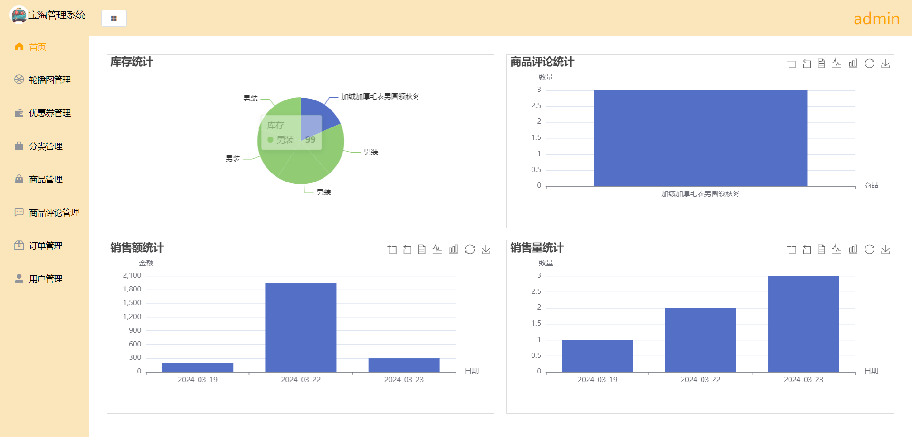

 

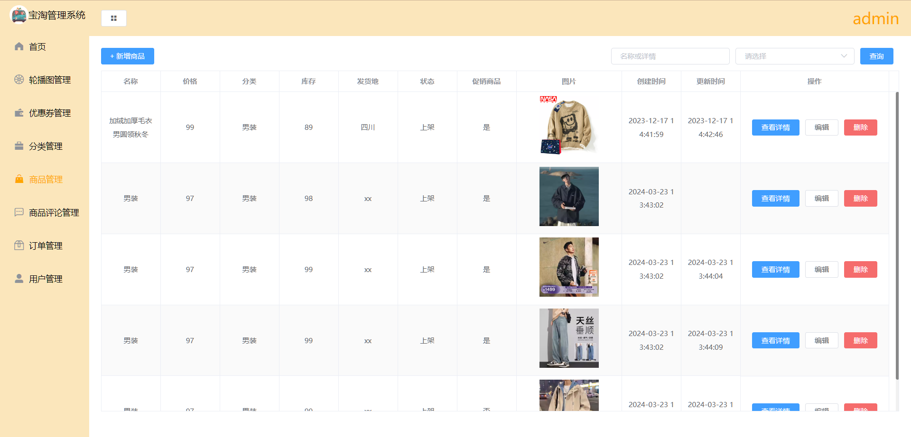

 

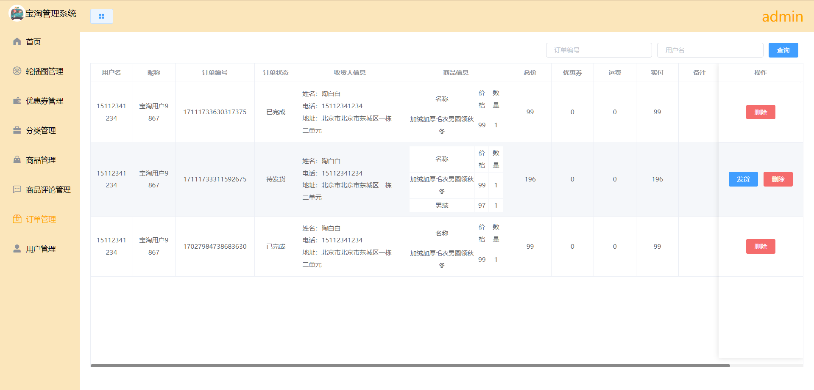
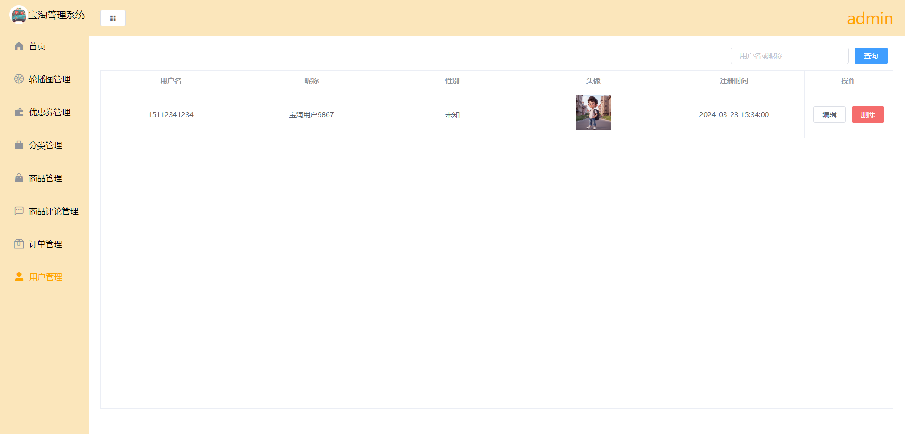

## 四、🚀 咨询我们
1. **个人手敲，独立编写项目，不是网上所找的资源**
2. 提示该项目需要付费获取，编码不易，有需要或者疑问可加微信号：rolling_257
3. 扫一扫加我微信好友吧，请备注 失物招领小程序源码获取

